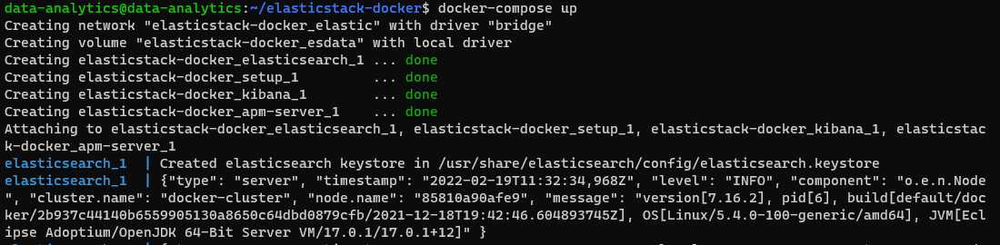
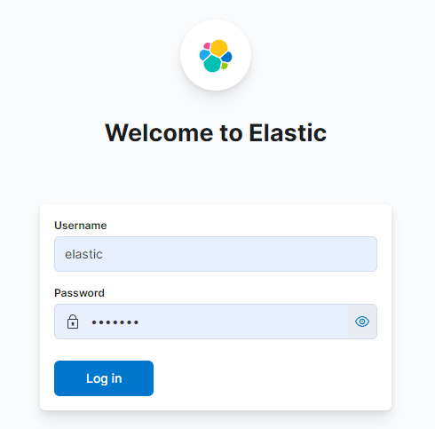
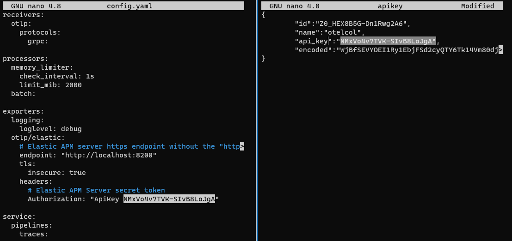
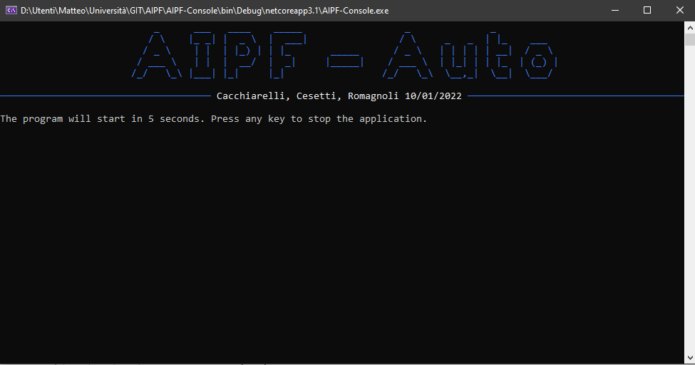

# Data Analysis on Machine Learning performance
The objective of this project is to define a prototype in C# that is able to analyze in real time the diagnostic of the AIPF system, extending it. The system is able to use different Machine Learning models at run time and, by this way, we are able to analyze the different models and understand what is the best.

We have already defined three different Machine Learning contexts and for each we have one or more Machine Learning models we can analyze.

We are going to use OpenTelemetry and ElasticSearch to provide data analysis.

## Prerequisite
As already said, the system is developed in the .NET environment and in order to run the application we need the .NET framework.

Since we are going to perform analysis on top of this system we are going to use a virtual machine in which we set up OpenTelemetry Collector and the Elastic Stack. The Elastic Stack Docker contains Docker images for all of the products in the Elastic Stack. So we used Docker compose to easily get the default distributions of Elasticsearch, Kibana, and APM Server up and running in Docker.

## Configuration
Ubuntu server 20.04.3 LTS<br>
Docker 20.10.10 <br>
Docker Compose 1.24.0 <br>
Elastic 7.16.2 <br>
OpenTelemetry Collector 0.45.0

Minimum RAM for VM: 4GB (Recommended 8GB)

## Installation
The first thing to do is to define an ubuntu server (virtual machine), with Docker and Docker-Compose already installed, and transfer the zip `AIPF-Server config.zip` that contains 2 folders:
- _elastic-stack_ in which there are:
   - _`.env`_: a configuration file in which we set the password of elastic and kibana, the version of the stack, the ports of elastic and kibana, the cluster name, the license and finally the memory limiter.
   - _`docker-compose.yml`_: the docker file of elastic-stack (Elasticsearch, Kibana and APMServer)

- _collector_ ([GitHub](https://github.com/open-telemetry/opentelemetry-collector-releases/releases/tag/v0.45.0)) in which there are:
   - _`config.yaml`_: the configuration file for the OpenTelemetry Collector that reports the receiver, processor and exporters. In particular, inside the exporter we have to configure the section headers, but we will see it later on.
   - _`otelcol`_: the OpenTelemetry collector executable itself.
   - `LICENSE` & `README`.

Once you have unzipped `AIPF-Server config.zip`, you can modify the `.env` file, in which you can modify the **ELASTIC_PASSWORD** (used to login into ElasticSearch later on) and **KIBANA_PASSWORD** (you have to set a password at least length 6), the **STACK_VERSION** (you have to set an available elastic version, that you can took from [here](https://www.elastic.co/downloads/past-releases#elasticsearch)), and other settings. Of course you can leave the default values.

Then you can start the docker-compose using the following command (to issue inside the folder that contains the docker-compose.yml):

```
$ docker-compose up
```

You can use also the command<br>

```
$ docker logs -f
```

to see the logs generated by the docker. At the end you should have something like this:

<p align="center"> </p>


Now you can connect to elastic using the following url `http://server_ip:KIBANA_PORT` for example `http://192.168.1xx.1xx:5601`.  You should see the elastic login: 

<p align="center"> </p>

You need to authenticate to the elastic portal using the elastic account (username: elastic, password: ELASTIC_PASSWORD); Once inside, you need to [create an Api Key](https://www.elastic.co/guide/en/apm/guide/7.16/api-key.html) (Stack Management -> Api Key -> Create new ApiKey) that is required in order to send the data from the OpenTelemetry Collector. Save the output as JSON!

So, the next step is to modify the `config.yaml` inside the telemetry folder. In particular you need to override the ApiKey value, under the headers section, using the api_key value from the JSON: 

<p align="center"> </p>

Now you are ready to start the OpenTelemetry Collector using the command:

```
./otelcol --config=config.yaml
```

The configuration of the server is done, you can switch to the client. You have to download the .NET project and open the file config.json located inside AIPF-Console solution with an editor in order to set the correct server IP:

```json
{
    "ip": "192.168.***.***",
    "consoleType":"auto",
    "rest": false
}
```

Finally, you can compile and run the AIPF-Console solution: 

<p align="center"> </p>

Performing some operations, like fit, predict or evaluate, the system will report the telemetry data to the collector and the to elastic APM.

In order to see metrics inside elastic APM you have to change the metrics indexes (simply go in apm -> metrics -> settings -> indexes and set to `metrics-apm*,apm-*`).

Inside the APM the traces/metrics are coming and we can analyze them; we can go to services under APM and select the AIPF-service.

## Usage

First of all we have to start the docker that contains Elastic Stack (ElasticSearch, Kibana e APM Server)  by executing _docker-compose up_, into the elastic-stack folder, and starting the OpenTelemetry Collector executable.

Once it is done, we have to power on AIPF-Console on the guest machine and select one of the following models:
- **MNST**: In this example we use our system to implement a machine learning model that allows us to recognize the numbers from an image. For Training we used the MNIST data set that provides us the images in the form of bites arrays. There are two pipelines for this model:
   - The first pipeline, _MNIST default_, is composed by the following steps: [**i**] we convert the input array of size 32x32, made by 0 and 1, into an Image; [**ii**] we resize the image from 32x32 to 8x8; [**iii**] we convert the image into a flat vector of size 64; [**iv**] we finally apply the ML algorithm (SdcaMaximumEntropy) to the processed data.
   - The second pipeline, _MNIST custom_, is composed by the following steps: [**i**] we resize the input array of size 32x32, made by 0 and 1, to 8x8 by summing 4x4 blocks; [**ii**] we convert this matrix into a flat vector of size 64; [**iii**] we finally apply the ML algorithm (SdcaMaximumEntropy) to the processed data.

- **Taxi-Fare**: In this example we use our system to implement a machine learning model that allows us to estimate the taxi fare. There are four pipelines for this model:
    - _Taxi-Fare Huber_: [**i**] the first step is a filter that remove all useless data; [**ii**] after this, it is applied Euclidean Distance that calculate the distance between two point defined in term of geographic coordinates (Latitude and longitude); [**iii**] on this data is applied a filter that remove all data with a distance that doesn't satisfy it; [**iv**] and finally apply the Huber algorithm in ONNX format to the processed data.
    - _Taxi-Fare Linear_: [**i**], [**ii**], [**iii**] are the same; [**iv**] we apply the Linear algorithm in ONNX format to the processed data.
    - _Taxi-Fare Pca Huber_: [**i**], [**ii**], [**iii**] are the same; [**iv**] we apply the Pca algorithm in ONNX format and then we apply the Huber algorithm in ONNX  format to the processed data.
    - _Taxi-Fare Pca Linear_: [**i**], [**ii**], [**iii**] are the same; [**iv**] we apply the Pca algorithm in ONNX format and then we apply the Linear algorithm in ONNX format to the processed data.

- **Robot-Loccioni**: In this example we use our system to implement a machine learning model that allows us to understand if the robot is behaving as we expect or if there are some anomalies. In particular this robot is like an arm with 6 axes for movement and is used to build car headlights. The algorithm, starting from the measured currents, calculates which production cycle has been carried out. If the production cycle does not correspond to that actually executed (so the measured currents are very different from the usual ones) then an alarm is reported. The pipeline that has been implemented is composed by the following steps: [**i**] the first step is a filter that remove all row with missing value [**ii**] after this, it is applied a filter that remove all useless data (for example is removed all event with value 0, that represent an error in value acquisition); [**iii**] and finally apply the ML algorithm in ONNX format to the processed data.

For each model there will be the opentelemetry option that will perform the model _Fit_ activity, then will execute the _Predict_ operation in order to simulate a real system behavior and finally the _Metrics_ about model accuracy and other parameters will be shown.

The data produced and sent to ElasticSearch by Opentelemetry are relative to two categories:

- **Metrics**: related to CPU and RAM usage;
- **Trace**: related to the executed activity (_Fit_, _Predict_, _Evaluate_); 

In **Fit activity** we defined the following tags: “_model_name_” define the name of the selected model, “_type_” define the type of the pipeline, “_processed_element_” represent the number of the processed elements and finally “_input_type_” and “_output_type_” define the data input and output type. Also all operation inside the model pipeline are described with similar tags; in particular, we have for the Filters the tags “_filter.type_”, “_filter.processed_elements_” and “_filter.input.type_” while for the other Transformers we have: “_pipeline_builder.type_”, “_pipeline_builder.processed_elements_”, “_pipeline_builder.input.type_”, and “_pipeline_builder.output.type_”.

In **Predict activity** we defined the following tags: “_model_name_” define the name of the selected model, “_type_” define the type of the pipeline, “_processed_element_” represent the number of the processed elements, the “_input.[property]_” and “_output.[property]_” that represent the input data and the predicted one and finally “_input_type_” and “_output_type_” define the data input and output type.

In **Evaluate activity**  we defined the following tags: “_model_name_” define the name of the selected model, “_type_” define the type of the pipeline, “_processed_element_” represent the number of the elements used to evaluate the model, “_input_type_” and “_output_type_” define the data input and output type and finally “_metric.[algorithm].[metric_name]_” that represents the metrics of the model and depends on the Machine Learning Algorithm.

Collected data are used to define ElasticSearch’s graphs and charts. We defined 3 different dashboards: 

1. A general dashboard that contains the CPU and Memory metrics, the model count grouped by name, the models usage during time grouped by name, the average of the activities,  and finally charts related to the process and threads.

<p align="center"> </p>

2. The TaxiFare dashboard in which we compare the 4 models (Linear, Huber, Pca linear, Pca huber); the first graph compare the duration of the main activities (Fit, Predict and Evaluate) for each models, the second one compare the metrics (LogLoss, Mean Absolute Error, Mean Square Error, Root Mean Square, RSquared) of the models, and finally we have the usage of CPU and Memory by each models during time.

<p align="center"> </p>

3. The MNIST dashboard where the MNIST-Default and MNIST-Custom models are compared; the first graph compare the duration of the main activities (Fit, Predict and Evaluate) for each models, the second one compare the metrics (LogLoss, LogLossReduction, MacroAccuracy, MicroAccuracy, PerClassLogLoss from 0 to 9) of the models, and finally we have the usage of CPU and Memory by each models during time.

<p align="center"> </p>
